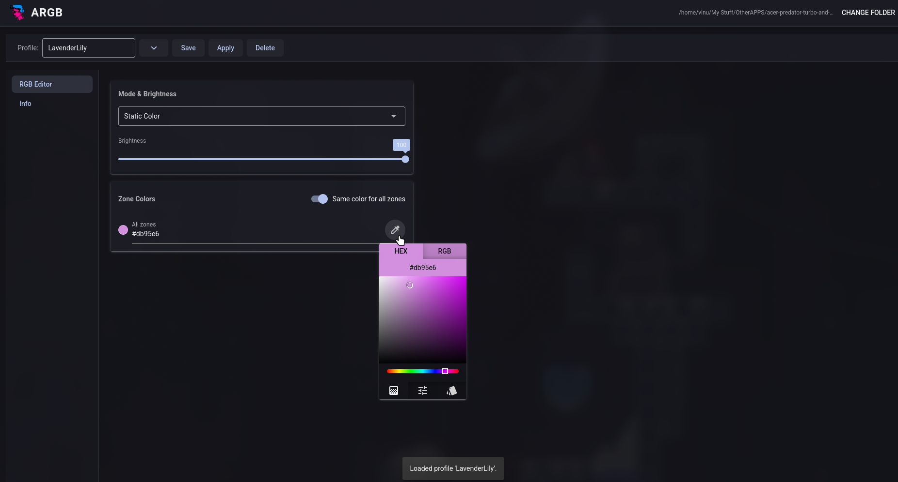
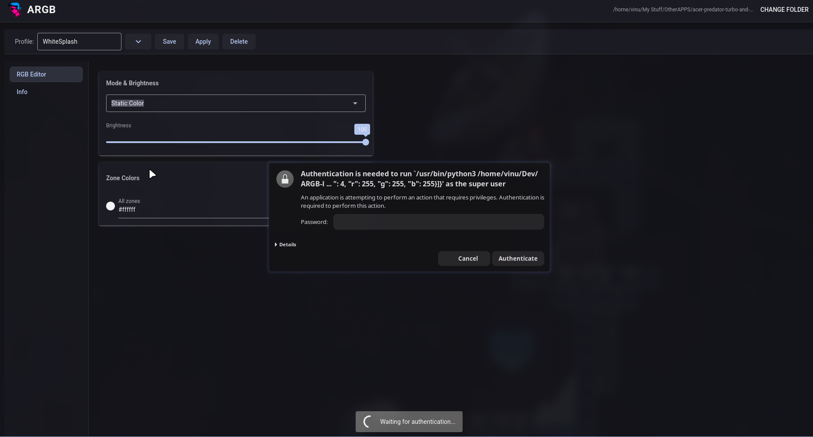

#  ARGB

A simple GUI for controlling 4-zone RGB keyboard lighting on Acer Nitro/Predator laptops [FOR LINUX], built on top of the [acer-predator-turbo-and-rgb-keyboard-linux-module](https://github.com/JafarAkhondali/acer-predator-turbo-and-rgb-keyboard-linux-module).

<p align="center">
  
</p>
<p align="center">
  
</p>
## Features

- Control all 6 lighting modes: Static, Breath, Neon, Wave, Shifting, Zoom
- Per-zone color control for Static mode, or one toggle to apply the same color to all 4 zones
- Save, load, and update named profiles
- Auto-detects your module install folder on first launch
- Native desktop window (or falls back to opening in your browser if `pywebview` isn't installed)
- Minimal — no elevated permissions needed until you actually click Apply

## Requirements

- **[acer-predator-turbo-and-rgb-keyboard-linux-module](https://github.com/JafarAkhondali/acer-predator-turbo-and-rgb-keyboard-linux-module)** — ARGB is a GUI front end for this module, it doesn't replace it. Install it first following that repo's instructions, **then reboot** before using ARGB. In my own testing, the module didn't reliably control the keyboard until after a reboot post-install — worth doing even if it seems to work right away. Also install the version which will work after rebbot [read the repo]
- **Python 3**
- **[NiceGUI](https://nicegui.io/)** — `pip install nicegui --break-system-packages`
- **polkit** (`pkexec`) — required to apply changes, since talking to the keyboard needs root
- *(optional, for a native window instead of opening in your browser)* **[pywebview](https://pywebview.flowrl.com/)** + its system backend:
  ```
  pip install pywebview --break-system-packages
  sudo pacman -S webkit2gtk-4.1 python-gobject gtk3   # Arch/CachyOS
  ```

> **Tested on:** Acer Nitro AN515-47 only, so far. If you try this on a different Acer Nitro/Predator model, please open an issue or let me know whether it worked — I'd like to build out a compatibility list.

## Install

```bash
git clone <this-repo-url>
cd ARGB-linux
chmod +x install.sh
./install.sh
```

This adds ARGB to your app launcher and checks for the dependencies above, warning you about anything missing.

First run: click **Change folder** and point it at your `acer-predator-turbo-and-rgb-keyboard-linux-module` folder if auto-detect doesn't find it.

## Update

Pull the latest code and rerun the installer — `install.sh` fully rewrites the launcher entry each time, so there's no need to uninstall first:

```bash
git pull
./install.sh
```

## Uninstall

```bash
chmod +x uninstall.sh
./uninstall.sh
```

Removes the app launcher entry and offers to delete your saved config/profiles at `~/.config/argb/`. Declining keeps them in place in case you reinstall later.

## Config

ARGB stores its settings at `~/.config/argb/`:
- `config.json` — your module folder path
- `profiles.json` — saved lighting profiles

This folder isn't touched by install or uninstall (unless you say yes to the uninstall prompt above), so your profiles survive updates.

## License

TBD — pick a license (e.g. [MIT](https://choosealicense.com/licenses/mit/)) and drop the corresponding `LICENSE` file in the repo root; happy to fill this section in once you've decided.
